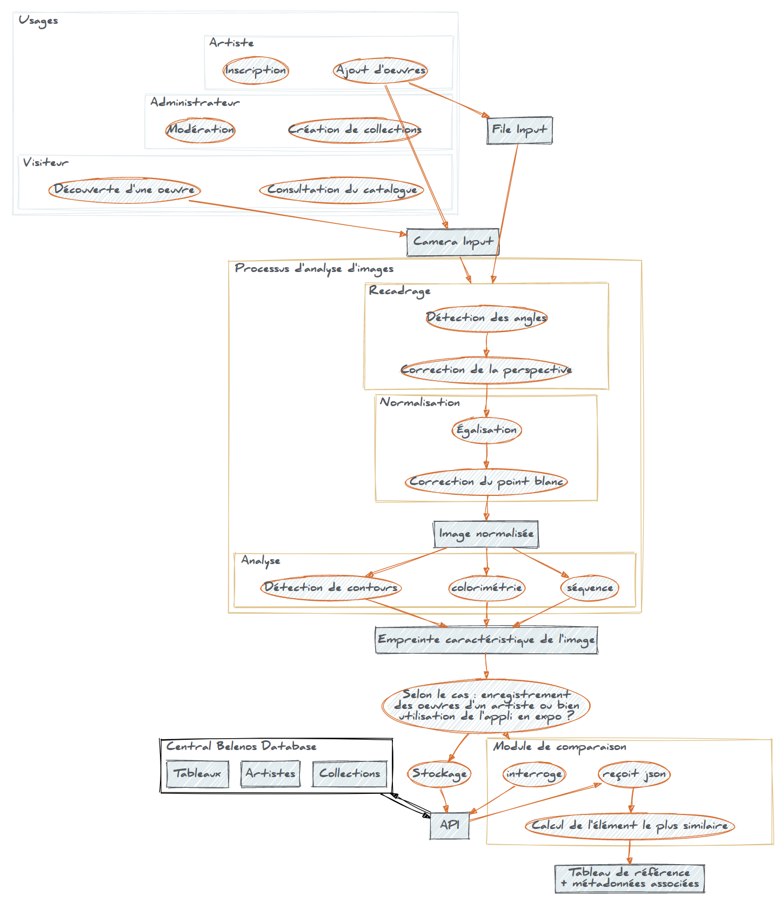

# art-recognition-tool
The ART project. Art Recognition Tool.

Pour l'instant le dépôt ne contient qu'une rapide démonstration de ce qu'on peut faire avec OpenCV (un histogramme RGB). Comme je le disais sur Slack, c'était principalement pour tester le gain de performance. On a un gain de l'ordre de ×10 par rapport à mon ancien algo, pour des calculs sur des images en pleine résolution d'un appareil photo.
Sont exclus du dépôt les fichiers issus de la compilation d'OpenCV, ce n'est pas l'objet ici.
En gros en partant des trois personas que j'envisage (Visiteur, Admin, Artiste, à voir si d'autres cas sont prévoir) ça donne ça :

Il faudra voir pour la licence. Le nom du dépôt est peut-être négociable.
