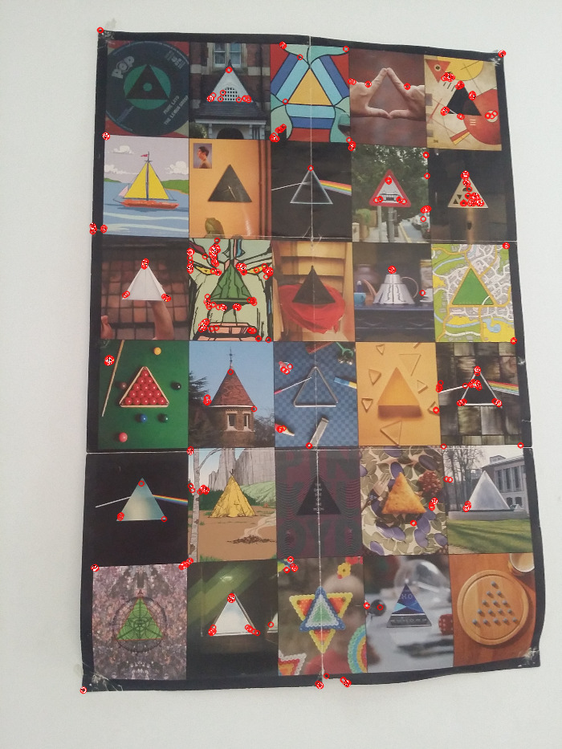
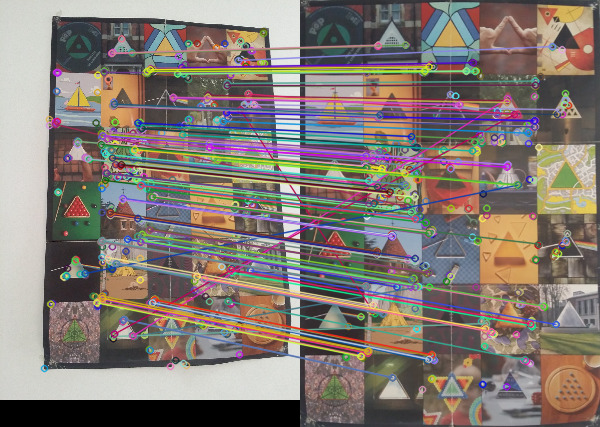

# art-recognition-tool

On utilisera la méthode ORB (ORiented FAST (Features from
Accelerated Segment Test) &  BRIEF (Binary Robust Independent Elementary
Features)) de détection de caractéristiques. Cet algorithme présente
l'avantage majeur d'être libre de droits, à la différence des
algorithmes classiques de détection de caractéristiques (SIFT ou SURF),
qui sont protégés par des brevets, et dont l'utilisation dans des
applications est donc payante.

L'utilisation de cet algorithme permet de mettre en évidence les
points-clés et descripteurs d'une image, de façon extrêmement rapide,
sans avoir à recadrer l'image au préalable. La méthode d'autocrop déjà
développée pourra néanmoins être utilisée en complément afin de procéder
à l'analyse colorimétrique.

Exemple de détection de caractéristiques par méthode ORB :

### Comparaison

Une fois ces caractéristiques établies, on peut les comparer avec celles
stockées pour les images de référence, avec une méthode de force brute.

Exemple de matching réussi :

### Normalisation

Exemple de correction de luminosité :

Avant :

Après :

