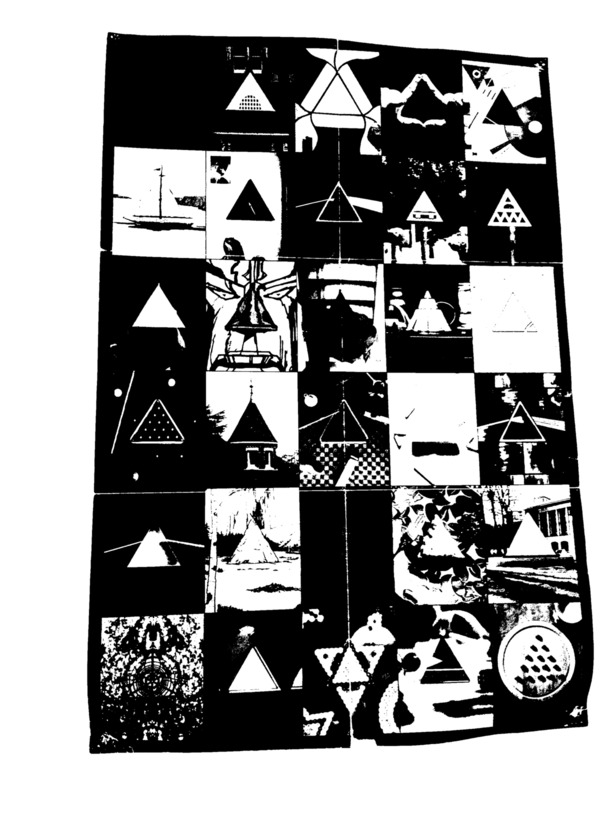
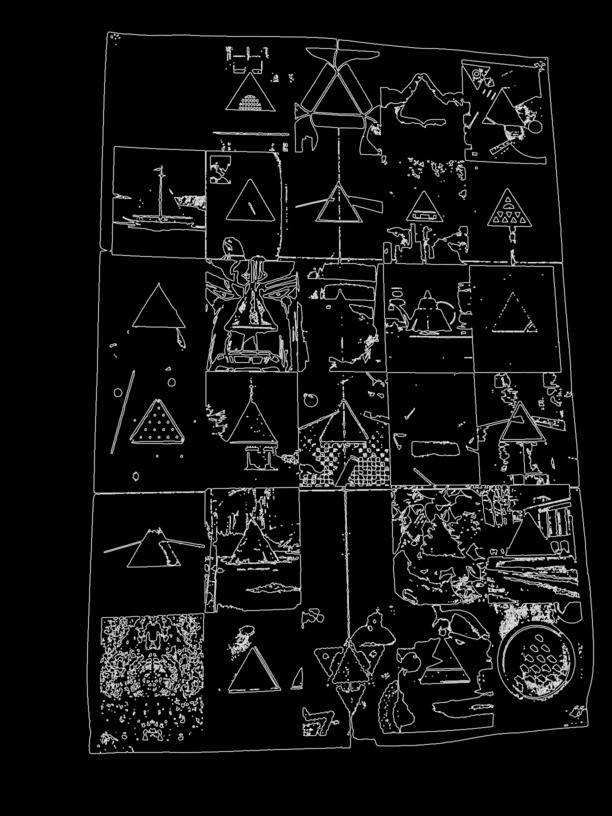

# art-recognition-tool
## The ART project. Art Recognition Tool.

## Description

Sont exclus du dépôt les fichiers issus de la compilation d'OpenCV, ce n'est pas l'objet ici.
En gros en partant des trois personas que j'envisage (Visiteur, Admin, Artiste, à voir si d'autres cas sont prévoir) ça donne ça :

Le diagramme ci-dessus est décrit dans le fichier `belenos.dot`, si jamais quelqu'un veut l'améliorer.

## Avancée des développements :
Cette section illustre les développements déjà réalisés.

### Recadrage

Image originale :

On applique un seuil :

Algorithme de Canny :

### Normalisation

Exemple de correction de luminosité :

Avant :

Après :

### Analyse

#### Colorimétrie
Calcul des histogrammes :

Exemple d'histogramme calculé dans l'espace de couleur RGB (modélisation des couleurs sur un écran) :

Exemple d'histogramme calculé dans l'espace de couleur HSV (modèle perceptif) :

Il faudra voir pour la licence. Le nom du dépôt est peut-être négociable.
