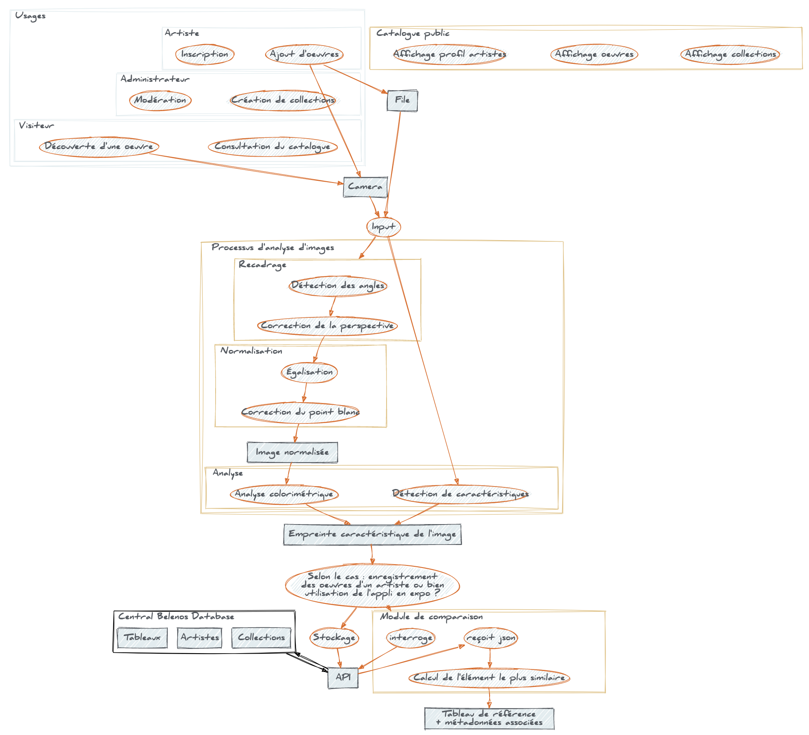
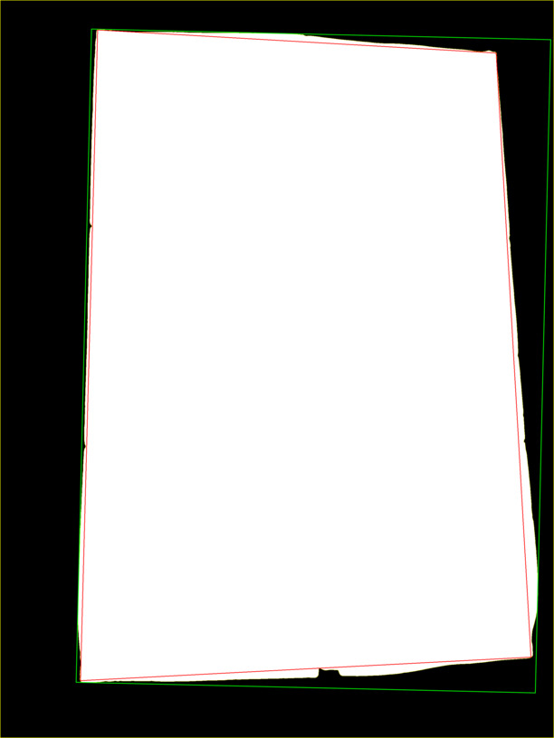

# art-recognition-tool
## The ART project. Art Recognition Tool.

## Description

### Outils et technologies utilisés

L'application utilisera de nombreuses innovations récentes du web :

Il s'agit de produire une [PWA (Progressive Web Application)](https://developers.google.com/web/progressive-web-apps/).
On obtient une application installable sur le périphérique client, quel
que soit l'OS. Par l'utilisation de [Service Workers](https://developer.mozilla.org/en-US/docs/Web/API/Service_Worker_API/Using_Service_Workers),
on peut fournir un proxy qui permet de rendre l'application utilisable
hors-ligne.

L'application repose sur la bibliothèque [OpenCV](https://opencv.org),
« une bibliothèque graphique libre, initialement développée par Intel,
spécialisée dans le traitement d'images en temps réel » (source :
Wikipédia). S'agissant ici d'une appli web, la bibliothèque est compilée
en [WASM (Web Assembly)](https://developer.mozilla.org/en-US/docs/WebAssembly),
ce qui nous permet d'exécuter du code bas niveau et d'échanger avec
celui-ci dans un environnement web (navigateur + JS).

Ce module WASM est encapsulé dans un [Web Worker](https://developer.mozilla.org/en-US/docs/Web/API/Web_Workers_API)
afin que ces calculs soient effectués dans un thread séparé, en
arrière-plan. Par ailleurs, l'acquisition vidéo profitera de 
[l'API Media Capture & Streams](https://developer.mozilla.org/en-US/docs/Web/API/Media_Streams_API),
qui offre une interface standard pour accéder à la caméra de
l'utilisateur, l'élément HTML5 [Canvas](https://www.w3schools.com/html/html5_canvas.asp)
et son [API associée](https://developer.mozilla.org/en-US/docs/Web/API/Canvas_API)
sont bien sûr utilisés pour l'affichage. Enfin, l'ensemble du code
exploite les dernières innovations des spécifications ECMA (méthodes
sur les tableaux, fonctions fléchées ou asynchrones, promesses,
décomposition, etc. )

Sont exclus du dépôt les fichiers issus de la compilation d'OpenCV, ce
n'est pas l'objet ici.

### Diagramme fonctionnel

En partant des trois personas que j'envisage (Visiteur, Admin, Artiste,
à voir si d'autres cas sont prévoir) ça donne ça :



Le diagramme ci-dessus est décrit dans le fichier `belenos.dot`,si
jamais quelqu'un veut l'améliorer. Ce dépôt se concentre sur les deux
blocs "Processus d'analyse d'images" et "Module de comparaison".
Pour que ce soit optimal, à terme, il faudrait (comme décrit dans le
schéma) une API qui permette d'intéragir avec le dépôt central, de façon
à pouvoir ajouter différents modules au fil du temps.

Ce que j'appelle le "catalogue" correpond au site public. On peut
*a mimima* y consulter les fiches des artistes, voire les descriptifs
des œuvres ou le catalogue de chaque collection. Il me semble avoir
compris que vous envisagiez un module pour que les clients puissent
voter pour la prochaine collection qu'ils souhaitent voir exposée. La
création et la modification des collections sont réservées aux
administrateurs, qui exercent également un rôle de modération des
inscriptions des artistes. En effet, on réserve le travail
d'alimentation du catalogue aux artistes, qui s'inscrivent sur le site,
remplissent leur profil et chargent leurs travaux. Un module de ventes
pourrait également être implémenté. L'application de reconnaissance
d'images reçoit de l'API les descriptions des œuvres d'une collection
donnée, selon l'expo visitée par l'utilisateur.

## Utilisation

OpenCV est utilisable à travers le Web Worker `worker_opencv.js`, lequel
instantie un objet Picture. Afin de pouvoir interroger le worker de
façon synchrone, on créé un objet AWorker :
```const OCV = new AWorker("worker_opencv.js");```
On initialise le worker avec un message, où `imgData` correspond à une
matrice de pixels extraite d'un [canvas](https://www.w3schools.com/html/html5_canvas.asp) :
```worker.postMessage({imgData:imgData,cmd:"init"});```
Ceci se fait à l'instantiation de la classe Picture dans le thread
principal, qui offre des interactions de haut niveau :
```myPicture = new Picture(imgData,OCV);
await myPicture.autocrop();
await myPicture.normalize();
myPicture.output(); ```
## Avancée des développements :
Cette section illustre les développements déjà réalisés. Les images
affichées ici le sont à des fins illustratives ; ce sont des étapes de
calcul qui ne seront pas montrées à l'utilisateur final.

On voit que l'on a déjà les briques fondamentales du module "Processus
d'analyse d'images". Il faut désormais les calibrer, c'est à dire
ajuster chaque brique finement de façon à pouvoir traiter le plus de cas
possible (diversité de situations en luminosité & contraste).
L'utilisation des méthodes CLAHE, Otsu et du flou (cf. infra) relève de
cette démarche.

### Recadrage

La capacité à pouvoir recadrer ou non l'image dépendra essentiellement
de la possibilité de la distinguer facilement du fond, sur la base du
contraste essentiellement. Le fait que l'image soit encadrée, (ou bordée
de noir comme l'exemple ci-dessous) facilite grandement cette étape.

Image originale :


Égalisation de type CLAHE (Contrast Limited Adaptative Histogram
Equalization) :


Flou, pour adoucir le rendu de l'étape suivante :


On applique un seuil, déterminé par l'algorithme d'Otsu :


Détections de contours :


Isolation du plus grand contour :


Détermination du MBR (minimum bounding rectangle) : (en vert)


Algorithme de Ramer–Douglas–Peucker : (polygone rouge)



Transformation en perspective pour faire coller l'intérieur du polygone
rouge aux dimensions du rectangle vert :


### Normalisation

Exemple de correction de luminosité :

Avant :


Après :


### Analyse

#### Colorimétrie
Calcul des histogrammes :

Exemple d'histogramme calculé dans l'espace de couleur RGB (modélisation
des couleurs sur un écran) :


Exemple d'histogramme calculé dans l'espace de couleur HSV (modèle
perceptif) :


Il faudra voir pour la licence. Le nom du dépôt est peut-être
négociable.
